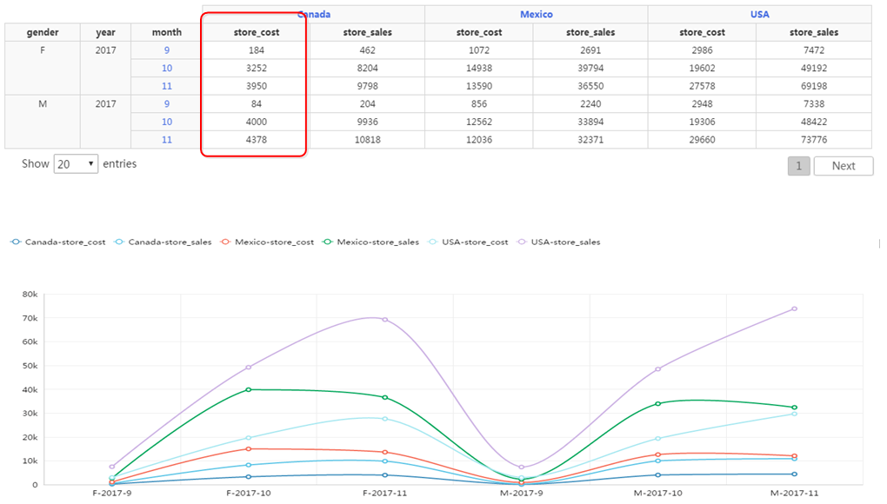
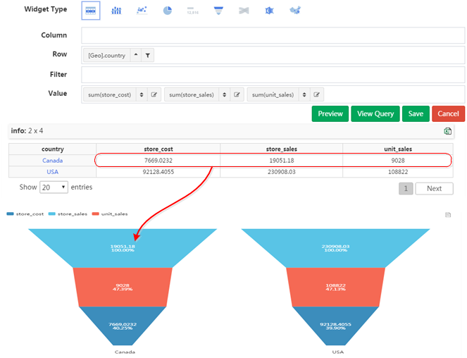
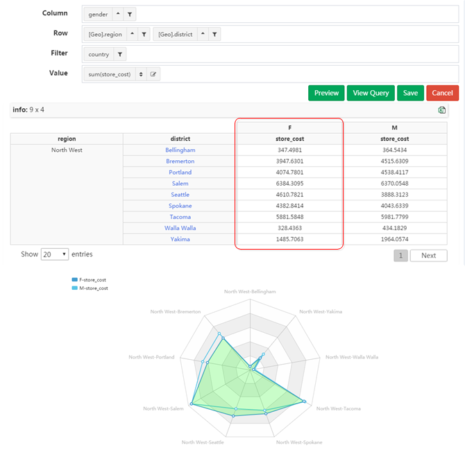
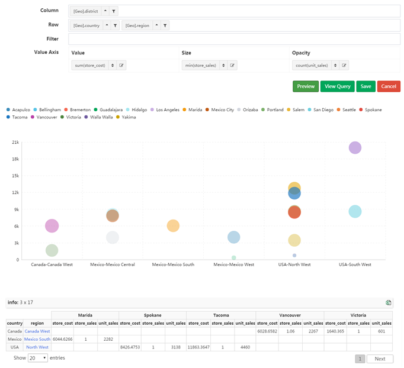
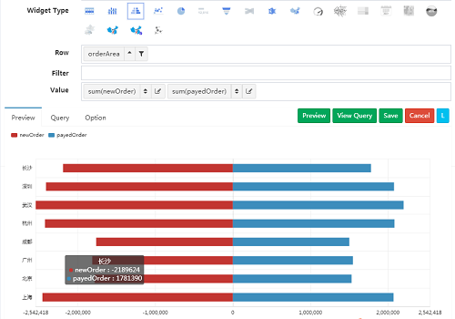

<h1> 图表设计 </h1>

---

**图表设计-&gt;new-&gt;数据源（下拉选择）**

## 获取数据

### 已有数据集
已有数据集能够加载之前预定义的聚合表达式、过滤漏斗, <mark>不能在图表设计页新建表达式</mark>

### 读取JDBC数据
默认获取数据方式为读取已有数据集，点击切换为查询获取数据之后，选择要查询的**JDBC数据源**需要填写读取数据对应的_SQL TEXT_，真正实现**Type SQL, Get Chart的体验**

### 读取Saiku2.x数据

**Saiku数据**需要填写Saiku Repository下面保存查询的path

<table class="table table-bordered">
    <thead>
        <tr>
            <th>Saiku Repository</th>
            <th>CBoard Saiku Query</th>
        </tr>
    </thead>
    <tbody>
        <tr>
            <td></td>
            <td></td>
        </tr>
    </tbody>
</table>

## 图表设计

    
    
图表设计功能区

### 界面模块介绍
#### 图表列表区
* 显示已保保存的图表
* 左上角功能键可以新建、复制、编辑、删除图表，除新建图表外，其他的操作需要先选中单个图表
* 删除也一样只能删除单个图表
* 用户在保存列表名称时候按照\[Folder\]?/\[SubFolder\]\*/\[图表名称\]的格式保存之后，会自动目录树结构
* 列表中的文件加为虚拟目录，实际上并不存在文件夹实体
* **鼠标双击图表**进入编辑状态
* 选中图表**键盘Delete**可以快捷删除一个图表
#### 查询区
* 查询区默认为选择已经保存的数据集\(Cube\)
* 下方两个功能按钮分别为切换查询方式\(在数据集与新建AD-Hoc查询之间切换查询\)，加载数据（JDBC离线数据源数据会加载至服务端缓存，支持数据源聚合的连接对应的查询只会加载模型）
* **【当前操作状态】**
    * **新建\(New\)**状态：新建状态下每次保存都会新建或者另存一个图表，方便连续设计不同粒度的不同展示形态的多张图表，当然也可以通过复制功能，复制之后再进入编辑
    * **编辑\(Edit\)**状态：修改保存至影响当前报表，可以重复点击保存

!> 新建状态下如果不修改图表名称，连续点击保存会提示重名错误

#### 模型区
* 模型区的层级结构\(Hierarchy\)需要在数据集设计页面提前定义，否则只能看到原始的可选列属性
* 模型包含4个一级分类节点
* **维度\(Dimensions\)**
* 层级下面的列在支持下钻的图表组件下面可以进行下钻/上卷操作

* **度量\(Measures\)**
* **二次计算指标\(Calulated Measures\)**
* 预先定义： 数据集预先定义只能使用，不能修改，不能查看具体内容；数据集上对指标进行修改会影响图表；数据集中删除已经在图表中使用的指标会导致图表运行失败
* **+** 新建: 新建的计算指标可以修改，只在当前图表有效，其他图表中不可见
* 只在单列上的聚合操作可以不使用计算维度
* **过滤器\(Filter\)**
* 预先定义： 数据集预先定义只能使用，不能修改，不能查看具体内容
#### 设计区
* 图表名称格式如：\[Folder\]?/\[SubFolder\]\*/\[图表名称\]
* 图表类型切换：不同类型的图表对于输入有不同的限制，鼠标放置在图表类型ICON上面有详细提示，点亮状态下为理论可切换状态
* 通过拖拽至设计区输入栏进行OLAP设计

| 设计区目标框 | 模型区节点类型 |
| :--- | :--- |
| **行维**框、**列维**框、**过滤**框 | **维度**\(Dimension\)节点 |
| **指标/值**框 | 指标列节点、可选表达式节点 |
| **过滤**框 | 维度节点、过滤器节点 |

* 功能按钮
* 预览
* 预览查询：用于查看、调试数据源聚合查询下动态查询脚本
* 保存
* 取消：暂时没有功能
* **【预览区】**
预览图形

### 基本原理★

OLAP多维分析的数据理论上都基于多维数据，多个序列<kbd>series</kbd>加上相同的index，数据上与之对应最直观的展现为交叉表，交叉表原理同Excel的透视表  

| 交叉表组成 | 图表设计栏 |
| :--- | :--- |
| 行表头 | 行维栏放置的胶囊 |
| 列表头 | **列维栏**放置的胶囊 与 **值栏**胶囊的组合 |
| 中间交叉处对应的聚合数据 | 交叉表头查询条件的数据集合+聚合函数 |

* 对应关系如下图所示，交叉表的表头合并只有在表头排序正确的情况下才能正确合并
* 开始图表设计之前请先理解此处的对应关系。后续所有图表对应的数据都和交叉表相关

### 维度过滤/切片排序

* 放置在**行维**与**列维**上面的**胶囊**点击编辑按钮可以进行数据过滤
* 也可以放置**维度**在**过滤**栏单纯对数据进行过滤

  
<i class="fa fa-exclamation-circle" aria-hidden="true"></i> 注意:

  
为了防止某个维度下面成员数量过大，或者误把连续值如时间戳之类的维度不经处理直接放置在维度框，引起服务端数据源查询压力过大，所以再加载维度成员之前加入了确认操作  

* 过滤比较只支持字符串和数值型比较，由于不同数据库的时间函数处理不一样，但是大多数数据库的时间都能与一个标准的日期字符串进行比较，可能某些数据库会有由于数据类型转换引起的索引失效，这里没有特殊处理，请数据准备的时候在这块进行一些预处理，时刻使用预览查询进行调试
* 值上的列也可以排序和过滤（0.3之后）
* 支持输入值域范围比较
* TOP N展示
* 从交叉表的形式可以看出，在值排序与行表头排序是冲突的，**行排序、各值排序有且仅有一个生效**

### 基础图形
#### 柱线图

每列显示显示为一条线，或者一个柱形图序列。

| 设计区 | 图表 | 要求 |
| :--- | :--- | :--- |
| 行维 | X轴 | 放置一个或者多个维度节点 |
| 列维 | 分类 | 放置0个或者多个维度节点 |
| 指标 | | 放置1个或者多个指标节点\(**请不要在没有放置指标的时候反复的问我们为什么没有图形出来**\) |
| 添加轴 | 显示双轴 | 建议为不同的轴配置成不同的图形类别，如：柱线 |
| 垂直/水平 | X/Y轴位置互换 | |

#### 饼图

每列显示一个饼图

#### KPI

KPI输入没有维度信息，只有**一个度量值**，可选择颜色和数字格式化，格式化Formtter参考[numbro做format](http://numbrojs.com/format.html)

#### 漏斗图

一般情况下一个漏斗需要显示如 \_展示-&gt;点击-&gt;提交-&gt;付款, 一连串不同度量的数值， 在交叉表里面为值轴放置的多个列
行里面的值会按大小自动排序之后形成漏斗
**所以漏斗图一行一个漏斗**， 下面的Demo没有实际意义，仅仅作为演示说明

#### 桑基图

以行值和列值为节点，单元格为**行到列**的连接进行画图，交叉表可以视为一个连接矩阵

    <h4>为什么我的桑基图没有层级？</h4>
    
有很多人问为什么自己的桑吉图没有层级，其实桑基图的层级和你的数据本身有关.

    数据里面有
    A -&gt; B 和 B -&gt; C， B为中间层，就会自动适配出两层
    另外注意一点EChart对数据要求，不能成环 \(A-&gt;B..-&gt;A\)

#### 雷达图

一列数据在雷达上绘制一个网 

#### 气泡图

| 设计区 | 图表 | 要求 |
| :--- | :--- | :--- |
| 行维 | X轴 | 放置一个或者多个维度节点 |
| 列维 | 分类 | 放置0个或者多个维度节点 |
| 值 | Y轴、气泡大小、颜色深度 | 每个指标节点对应一个属性 |

#### 对比图

| 设计区 | 图表 | 要求 |
| :--- | :--- | :--- |
| 行维 | Y轴 | 只能放置一个维度节点 |
| 指标 | X轴左右两边 | 只能放置两个指标节点 |

